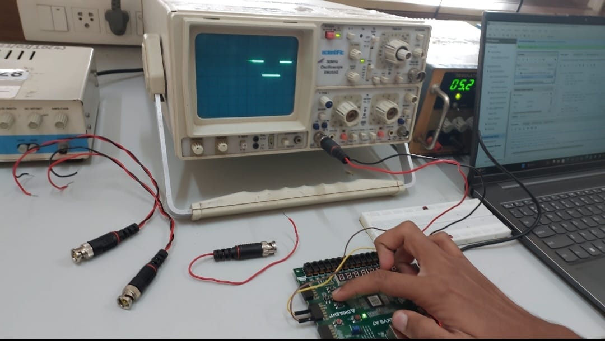
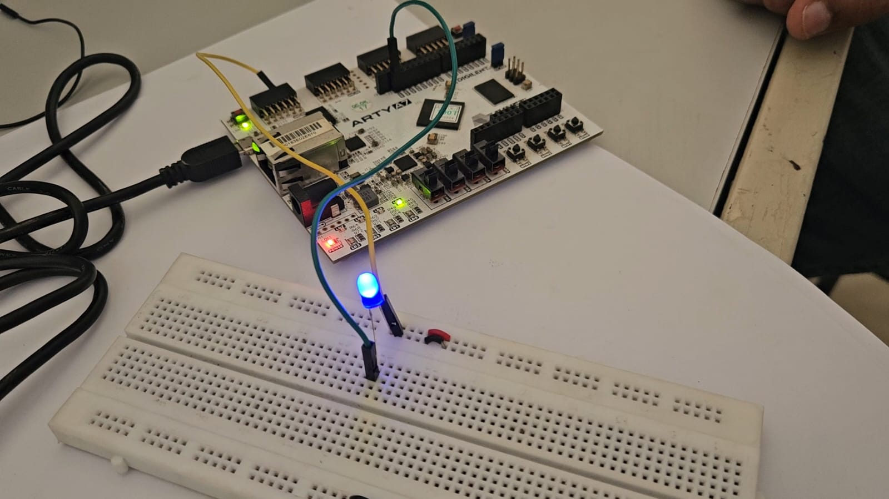

# Description
This project is a Vivado demo showcasing a PWM-based DC motor and LED control system implemented on the Arty A7 FPGA.

The PWM controller was written in Verilog, simulated using Icarus Verilog + GTKWave, and synthesized in Vivado. It was integrated with the RISC-V ET1035 SoC using port mapping, making it accessible through a memory-mapped register.

When programmed onto the FPGA, the RISC-V processor writes duty cycle values to the PWM register using a C program compiled with the Vega SDK. These values directly update the PWM hardware logic, which controls LED brightness and DC motor speed in real time.

The project demonstrates hardware-software co-design, combining RTL design, embedded programming, SoC integration, and FPGA prototyping.

# PWM Duty Cycle Behavior
| Duty Cycle (%) | LED Brightness  | DC Motor Speed |
| -------------- | --------------- | -------------- |
| 0%             | OFF             | Stopped        |
| 30%            | Dim             | Slow           |
| 50%            | Medium          | Moderate       |
| 70%            | Bright          | Fast           |
| 100%           | Full Brightness | Maximum Speed  |


# Requirements
- **Arty A7** FPGA Board (100T)
- **Vivado 2024.1**([Vivado 2024.1 User Guide](https://hthreads.github.io/classes/embedded-systems/labs/assets/guides/VivadoGuide2024_1.pdf).)
- **VEGA Tools SDK** (for RISC-V ET1035 compilation)
- **Tera Term** (Windows) or **Minicom** (Linux) (for UART bootloader + XMODEM transfer)
- **MicroUSB Cable** (for UART interface)
- **LEDs** and **DC Motor** (connected to FPGA outputs)

# Demo Setup
## Hardware

- Arty A7 board connected to PC via USB.
- PWM output pins connected to an LED and DC motor driver.

## Software

- **Vivado** (run TCL script to generate .xpr)
- **Vega SDK + Makefile** (to build RISC-V .bin)
- **UART Terminal (Tera Term / Minicom)** (for bootloader transfer)

 # Steps to Run the Demo

## 1. Generate Vivado Project from TCL Script

- Open **Vivado 2024.1**.  
- In the **Tcl Console**, run the following command:
> 💡 Example :
```text
source ./scripts/create_project.tcl
```

## 2. Build the Bitstream

- Open the generated project in **Vivado**.  
- Click **Generate Bitstream**.  
- Program the FPGA with the `.bit` file: 
> 💡 Example :
```text
./vivado_proj/ET1035_PWM.runs/impl_1/PWMdemo.bit
```

## 3. Compile RISC-V Program with Makefile

- Navigate to the `Software` folder:  
> 💡 Example :
```text
 cd sw
```
- Ensure the PWM base address (assigned during port mapping in hardware) is correctly defined in:

  - **config.h** → ccontains memory map (e.g., '#define PWM_BASE_ADDR 0x10400000') 
  - **pwm.h** →wraps the PWM register structure with '#define pwm_reg (*((volatile PWM_REG*)(PWM_BASE_ADDR)))'
    

  - **pwm.c** → contains functions (e.g., `pwm_set_duty(int value)`) that write duty cycle values to the mapped register
    > 💡 Example :
    ```text
    typedef struct {
    unsigned int DUTY_CYCLE;
    } PWM_REG;
    #define pwm_reg (*((volatile PWM_REG*)(PWM_BASE_ADDR)))
    ```
- Once configuration files are correct, run:  
 > 💡 Example :
```text
make
```

This compiles all sources (`main.c`, `pwm.c`, `uart.c`) and links them with Vega SDK libraries.  
- The final RISC-V binary will be generated as:  

 > 💡 Example :
```text
    pwm_test.bin
```
## 4. Load Program via UART Bootloader  

- Open a UART terminal (e.g., **Tera Term**/ **Minicom**) at `115200` baud.  
- Reset the FPGA → Bootloader banner will appear.  
- Select **Send File → XMODEM → pwm_test.bin**.  
- The bootloader copies the program into program memory.  
- Execution starts automatically, and **PWM duty cycle control** begins.  

## 5. Observe the Output  

- **LED brightness** changes smoothly as duty cycles update.  
- **DC motor speed** varies in proportion to PWM values.
# Additional Notes
  ## Generating Bitstream and Programming the FPGA
  - Open the project in Vivado 2024.1 by double clicking on the included XPR file found at "<archive extracted location>/vivado_proj/Arty-A7-100-XADC.xpr".
  - In the Flow Navigator panel on the left side of the Vivado window, click Open Hardware Manager.
  - Plug the Arty A7-100T into the computer using a MicroUSB cable.
  - In the green bar at the top of the window, click Open target. Select "Auto connect" from the drop down menu.
  - In the green bar at the top of the window, click Program device.
  - In the Program Device Wizard, enter "<archive extracted location>vivado_proj/Arty-A7-100-XADC.runs/impl_1/XADCdemo.bit" into the "Bitstream file" field. Then click Program.
  - The demo will now be programmed onto the Arty A7-100T.

# Results
## 1. 
## 2. PWM Signal Verification on Oscilloscope

The PWM module designed in Verilog was instantiated in the RISC-V ET1035 SoC and tested on the Arty A7 FPGA. The output waveform was observed on a cathode ray oscilloscope (CRO). Different duty cycles were generated by modifying the duty register from the C program, and the oscilloscope confirmed correct variations in pulse width, verifying the functionality of the hardware PWM design.
## 3. LED Brightness Control using PWM

The PWM output was connected to an LED on a breadboard. By changing the duty cycle through C code running on the RISC-V processor, the brightness of the LED varied accordingly. Higher duty cycles resulted in increased brightness, while lower duty cycles dimmed the LED. This demonstrated successful hardware-software integration and real-time PWM control.
  - Demo Video
  [Watch Video](Results/LED_video.mp4)
## 4. DC Motor Speed Control using PWM

The PWM output was further interfaced with an L293D motor driver module to control a DC motor. By modifying the duty cycle from the processor, the average voltage applied to the motor was varied, leading to different rotational speeds. The motor ran faster at higher duty cycles and slowed down at lower duty cycles, confirming the practical use of the designed PWM module in real-time embedded applications.
   - Demo Video
   [Watch Video](Results/DC_MOTOR_video.mp4)
## 5. Smart Street Monitoring using PWM, IR, and LDR
In addition to verifying PWM operation on oscilloscope, LED, and DC motor, the project was extended to a practical application: **Smart Street Monitoring System**. In this system, an **IR sensor** was used to detect the presence of vehicles and an **LDR sensor** was used to sense ambient light levels. The RISC-V processor continuously read sensor values via GPIO, processed the conditions, and accordingly adjusted the duty cycle of the PWM signal. The PWM output was then used to drive streetlight brightness:

**Obstacle detected** + **no light** → 100% duty cycle (LED fully ON for maximum brightness).

**Obstacle detected** + **sufficient light** → 70% duty cycle (LED partially ON).

**No obstacle** + light present → 30% duty cycle (LED dim to save power).

**No obstacle** + **no light** → 50% duty cycle (LED in standby brightness).

This implementation shows how the designed PWM hardware can be integrated into a real-time embedded control system. By combining **Verilog-based PWM logic, RISC-V processor control, and sensor feedback**, the project demonstrates a complete hardware-software co-design solution for energy-efficient streetlight monitoring.
   - Demo Video
   [Watch Video](Results/Application_Of_PWM_With_Audio.mp4)
